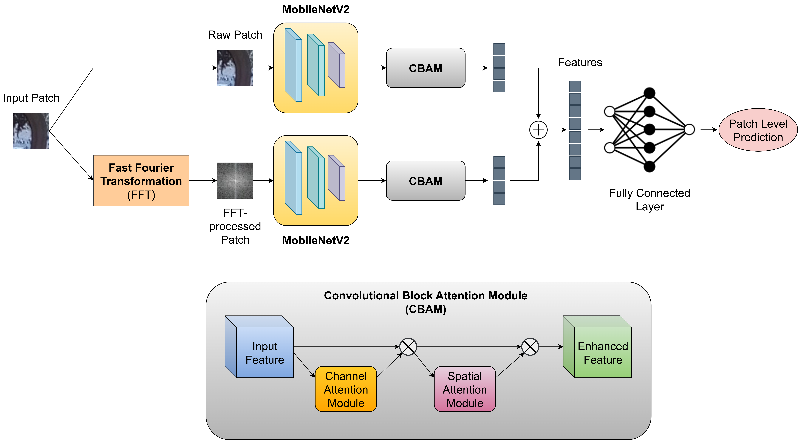

# FedFFTNet_SCMI_FedLearn

This repository contains implementation of various **FedFFTNet** method for Source Camera Model Identification in Federated Learning Setup. The process involves two major phases:

1. **Patching of Images**
2. **Model Training**

## 📁 Folder Structure

Ensure your dataset is pre-split into `train`, `test` folders in the following structure:

```
data/
├── train/
├── test/
```

## 🧩 Step 1: Image Patching

Laplacian based patching including distributing between global server and clients with a separated test dataset has been implemented.

### ➤ Notebook: `Fed_DataSplit_Laplacian.ipynb`

**Hyperparameters**

| Variable      | Type | Default      | Description                                      |
|---------------|------|--------------|--------------------------------------------------|
| `datapath `       | str  | `./data`     | Source data directory                            |
| `number_clients`      | int  | `5`  | Number of clients                    |
| `initial_ratio`    | int  | `0.06`        | Globally available data ratio |
| `dist_type` | str | `equal` | Data distribution : `equal`, `random`, `skew` |

---

### 🖼️ Patching Overview

<p align="center">
  
</p>

*Figure 1: Laplacian-based image patching and distribution across clients.*

---

## 🧠 Step 2: Model Training

Once patching is complete, the resulting folder (e.g., `patches/`) should contain `initial` (if any) , `clients`, and `test` directories.

### ➤ Notebook: `FedLearn_FedFFTNet.ipynb`

### Configuration Parameters

| Variable           | Type   | Default       | Description                                             |
|--------------------|--------|---------------|---------------------------------------------------------|
| `root`             | str    | `./patches`   | Directory containing patched data                      |
| `global_available` | bool   | `True`        | Indicates if global data is available                  |
| `batchsize`        | int    | `128`         | Batch size for training                                |
| `ROUNDS`           | int    | `100`         | Number of global communication rounds                  |
| `CLIENT_EPOCHS`    | int    | `1`           | Number of local training epochs per client per round   |
| `GLOBAL_EPOCHS`    | int    | `30`          | Number of global training epochs                       |
| `learning_rate`    | float  | `0.001`       | Learning rate                                          |
| `device`           | str    | `cuda:0`      | Device used for training (`cuda:i` or `cpu`) 


---

### 🧩 Model Architecture

<p align="center">
  
</p>

*Figure 2: Overview of the proposed FedFFTNet architecture used for federated learning.*

---

## ✅ Notes

- This code will be used for academic and research purpose only.
- Do cite the paper if using the method: Accepted on IEEE Transactions on Artificial Intelligence.
- @ARTICLE{11229953,
  author={Chakraborty, Rejoy and Goyal, Puneet},
  journal={IEEE Transactions on Artificial Intelligence}, 
  title={Source Camera Model Identification via Federated Learning using Laplacian-based Patches}, 
  year={2025},
  volume={},
  number={},
  pages={1-10},
  keywords={Noise;Cameras;Data privacy;Feature extraction;Training;Deep learning;Smart phones;Convolutional neural networks;Federated learning;Computational modeling;Federated Learning;Laplacian;Patch Extraction;Source Camera Model Identification;Deep Learning},
  doi={10.1109/TAI.2025.3629009}
}
---

